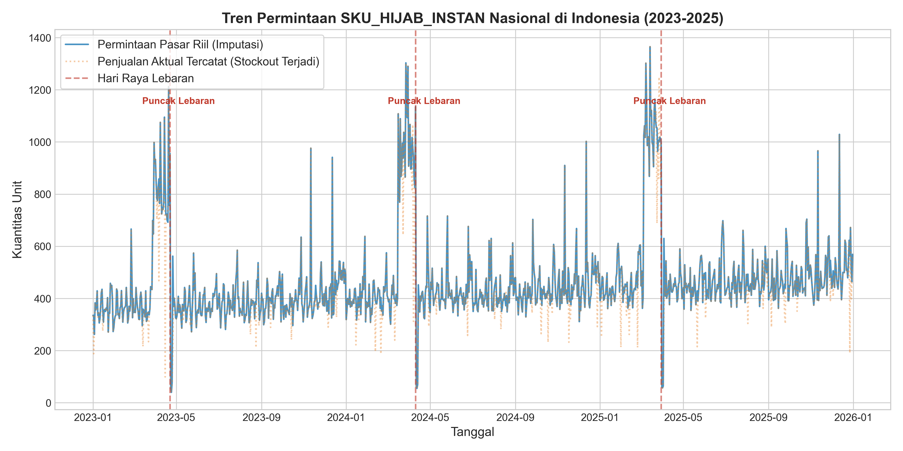
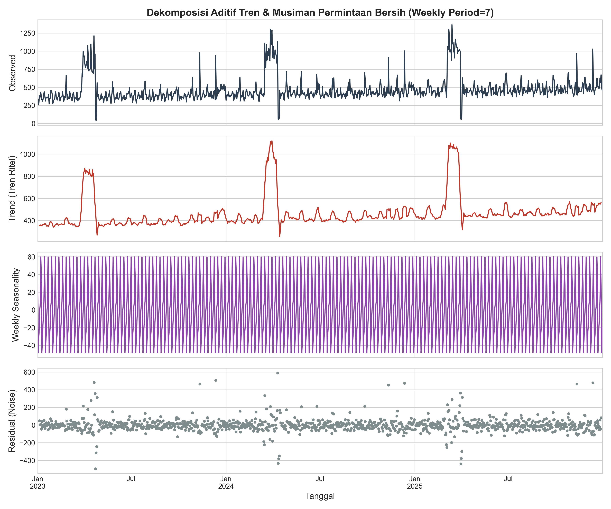
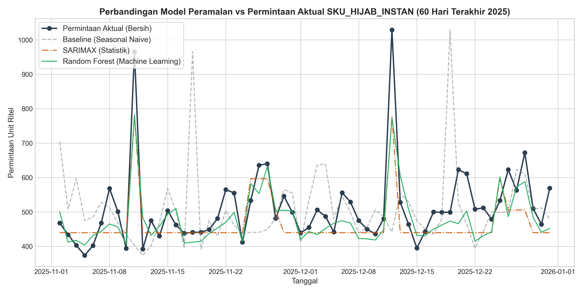
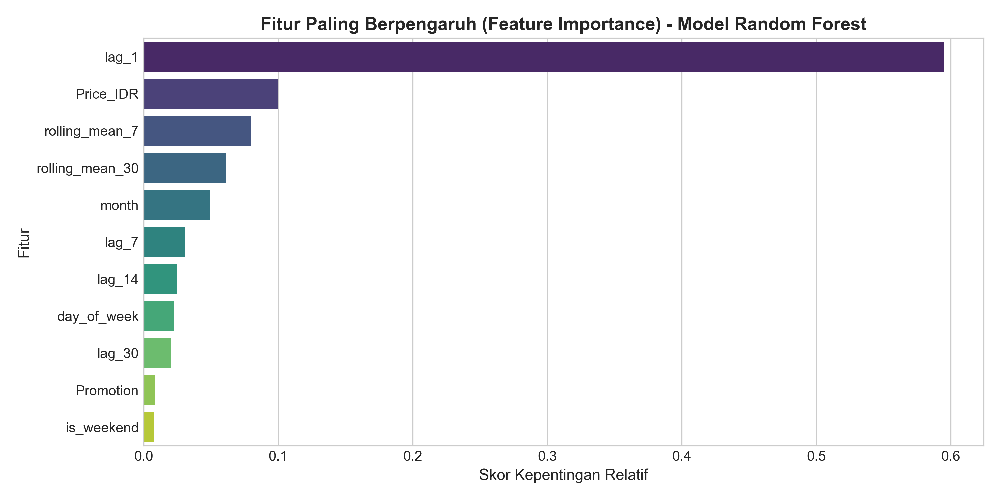
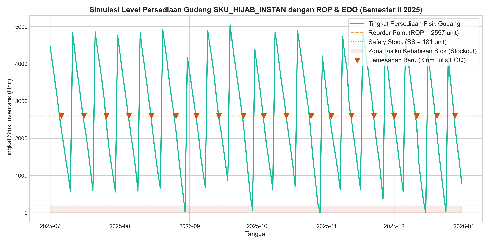

# Laporan Analisis Rantai Pasok & Optimasi Inventaris Ritel E-Commerce Indonesia

Laporan ini menyajikan analisis komprehensif mengenai peramalan permintaan (*demand forecasting*) dan strategi optimasi persediaan (*inventory optimization*) untuk produk **`SKU_HIJAB_INSTAN`** di Indonesia. Analisis ini mengintegrasikan data agregat nasional dari empat gudang regional utama (**Jakarta, Surabaya, Medan, dan Makassar**) untuk periode tahun 2023 hingga 2025.

---

## 1. Ringkasan Eksekutif & Latar Belakang Bisnis

### Masalah Bisnis
Industri ritel e-commerce fashion di Indonesia, khususnya kategori busana muslim, ditandai oleh volatilitas permintaan yang sangat ekstrem akibat pengaruh musiman budaya (Ramadan & Lebaran) serta kampanye promosi (Harbolnas 11.11 & 12.12). 

Tantangan utama yang dihadapi oleh divisi manajemen rantai pasok (*Supply Chain*) adalah:
1. **Risiko Kehilangan Penjualan (*Stockout*)**: Gangguan pengiriman akibat cuaca (seperti banjir tahunan Jakarta pada Januari-Februari) atau kemacetan logistik log-in pra-Lebaran di pelabuhan luar Jawa (Medan & Makassar) menyebabkan kekosongan stok di saat permintaan pasar sedang memuncak.
2. **Tingginya Biaya Penyimpanan (*Holding Cost*)**: Menyimpan stok terlalu banyak untuk mengantisipasi ketidakpastian permintaan meningkatkan biaya sewa gudang dan risiko barang usang (*obsolescence*).

### Tujuan Proyek
Proyek ini bertujuan untuk membangun sistem peramalan permintaan harian yang akurat menggunakan pendekatan statistik dan *machine learning*, serta merumuskan kebijakan persediaan yang optimal berbasis data untuk meminimalkan total biaya logistik sekaligus menjaga tingkat keandalan layanan (*Service Level*) sebesar **95%**.

---

## 2. Eksplorasi Tren & Pola Musiman Ritel Indonesia

Berdasarkan data historis 3 tahun yang dianalisis, permintaan ritel memiliki karakteristik musiman ganda (*double seasonality*):
* **Musiman Mingguan**: Volume penjualan meningkat tajam pada akhir pekan (Jumat hingga Minggu), mencerminkan perilaku belanja konsumen e-commerce Indonesia di waktu senggang.
* **Musiman Tahunan**: Lonjakan permintaan hingga lebih dari **120%** terjadi selama bulan Ramadan (3 minggu sebelum Hari Raya Idul Fitri), diikuti oleh penurunan tajam (hingga **85%**) pada hari H Lebaran karena libur operasional ekspedisi kurir domestik.
* **Spike Promosi**: Promosi Harbolnas (11.11 dan 12.12) serta gajian bulanan (*payday*) di akhir bulan (tanggal 25-28) memicu lonjakan jangka pendek yang signifikan.

Berikut adalah visualisasi tren permintaan historis agregat nasional beserta dekomposisi waktu mingguan:

---

## 3. Prapemrosesan Data & Imputasi Stockout

Ketika terjadi *stockout*, penjualan aktual tercatat bernilai `0` meskipun permintaan pasar riil (*unconstrained demand*) sebenarnya tinggi. Jika data penjualan mentah langsung digunakan sebagai input pemodelan, model peramalan akan menghasilkan estimasi yang bias ke bawah (*under-forecasting*).

Dalam proyek ini, divisi data analyst mendeteksi hari-hari terjadinya gangguan logistik lokal (banjir Jakarta & kemacetan pelabuhan) dan mengimputasi penjualan bernilai nol tersebut dengan **rata-rata bergerak 7 hari sebelumnya (*7-day rolling mean*)** untuk memulihkan pola permintaan riil sebelum melatih model peramalan.

---

## 4. Evaluasi Model Peramalan (*Demand Forecasting*)

Data dibagi menjadi **Training Set** (1 Januari 2023 - 30 Juni 2025) untuk melatih model dan **Testing Set (Holdout)** (1 Juli 2025 - 31 Desember 2025) untuk menguji akurasi prediksi pada data baru. Tiga model dievaluasi:
1. **Seasonal Naive (Baseline)**: Memprediksi permintaan hari ini sama dengan permintaan pada hari yang sama di minggu lalu ($t-7$).
2. **SARIMAX (1,1,1)x(1,0,0,7)**: Model statistik parametrik linear dengan memasukkan variabel eksogen harga barang (*Price*) dan status promosi (*Promotion*).
3. **Random Forest Regressor**: Model *machine learning* non-parametrik dengan fitur lag temporal ($t-1, t-7, t-14, t-30$), rolling average, serta fitur kalender nasional.

### Metrik Kinerja Evaluasi Model
Kinerja model diuji menggunakan metrik *Mean Absolute Error* (MAE), *Root Mean Squared Error* (RMSE), dan *Mean Absolute Percentage Error* (MAPE):

| Nama Model | MAE (Unit) | RMSE (Unit) | MAPE (%) | Keterangan |
| :--- | :---: | :---: | :---: | :--- |
| **Baseline (Seasonal Naive)** | 73.01 | 115.34 | 14.37% | Kesalahan relatif tinggi saat lonjakan promosi |
| **SARIMAX (Statistik)** | 47.89 | 64.89 | 9.30% | Menangkap efek promosi dengan baik |
| **Random Forest (Machine Learning)** | **40.76** | **53.67** | **8.00%** | **Akurasi tertinggi, sangat adaptif pada volatilitas** |

### Pentingnya Fitur (*Feature Importance*)
Model Random Forest menunjukkan bahwa variabel **`lag_7`** (permintaan pada hari yang sama di minggu lalu) dan variabel **`Promotion`** memiliki pengaruh paling dominan terhadap fluktuasi permintaan produk fashion Muslim ini:

---

## 5. Optimasi Inventaris & Parameter Logistik

Berdasarkan model terbaik (**Random Forest**) dengan standar deviasi kesalahan prediksi ($\sigma_e$) sebesar **49.17 unit**, kita menghitung kebijakan persediaan logistik yang optimal dengan parameter berikut:
* **Service Level Target ($Z$)**: **95%** ($Z = 1.645$)
* **Lead Time Pengiriman ($L$)**: **5 hari** (waktu pemenuhan dari vendor/pabrik ke gudang regional)
* **Biaya Pemesanan ($S$)**: **Rp750.000** per order (termasuk biaya pengiriman kontainer dan administrasi)
* **Biaya Penyimpanan ($H$)**: **Rp12.000** per unit per tahun (sewa gudang, asuransi, dan modal tertanam)

### Rumus Manajemen Persediaan

#### 1. Safety Stock (SS)
Safety Stock dirancang untuk melindungi gudang dari kehabisan stok jika terjadi lonjakan permintaan tak terduga atau keterlambatan pengiriman selama Lead Time ($L$).
$$SS = Z \times \sigma_e \times \sqrt{L}$$
$$SS = 1.645 \times 49.17 \times \sqrt{5} \approx 181\text{ unit}$$

#### 2. Reorder Point (ROP)
Reorder Point menentukan tingkat stok fisik minimum di gudang yang harus segera memicu perintah pemesanan kembali ke vendor.
$$ROP = (d \times L) + SS$$
Di mana $d$ adalah rata-rata permintaan harian nasional ($483.21\text{ unit}$).
$$ROP = (483.21 \times 5) + 181 \approx 2.597\text{ unit}$$

#### 3. Economic Order Quantity (EOQ)
Economic Order Quantity menentukan volume pesanan paling ekonomis untuk menyeimbangkan biaya sekali pesan dengan biaya simpan tahunan.
$$EOQ = \sqrt{\frac{2DS}{H}}$$
Di mana $D$ adalah total permintaan tahunan ($D = d \times 365 = 176.371,65\text{ unit}$).
$$EOQ = \sqrt{\frac{2 \times 176.371,65 \times 750.000}{12.000}} \approx 4.695\text{ unit}$$

### Ringkasan Parameter Logistik
* Rata-rata Permintaan Harian ($d$): **483 unit**
* Stok Pengaman (*Safety Stock*): **181 unit**
* Titik Pemesanan Ulang (*Reorder Point*): **2.597 unit**
* Jumlah Pemesanan Optimal (*EOQ*): **4.695 unit**

---

## 6. Simulasi Siklus Persediaan Gudang

Berikut adalah hasil simulasi siklus persediaan harian (*sawtooth curve*) selama Semester II tahun 2025 dengan menerapkan parameter kebijakan ROP & EOQ. Simulasi menunjukkan bahwa kebijakan ini berhasil menjaga tingkat persediaan di atas zona risiko stockout (arsiran merah) secara konsisten dengan total biaya penyimpanan yang efisien:

---

## 7. Rekomendasi Strategis & Bisnis

Berdasarkan hasil analisis data di atas, berikut adalah rekomendasi operasional bagi manajemen rantai pasok ritel e-commerce:

1. **Implementasi Sistem Pengadaan Otomatis (*Auto-Replenishment*)**:
   Gunakan parameter **ROP = 2.597 unit** sebagai pemicu pemesanan otomatis di sistem ERP gudang. Ketika stok fisik menyentuh angka tersebut, sistem harus otomatis merilis perintah pembelian sebesar **EOQ = 4.695 unit** ke pabrik garmen rekanan.
2. **Antisipasi Logistik Lebaran (Pre-ramadan Buffering)**:
   Mengingat adanya lonjakan permintaan hingga >120% saat Ramadan dan risiko hambatan logistik pelabuhan antar-pulau menjelang Lebaran (*shipping congestion*), tim logistik disarankan meningkatkan *Safety Stock* sementara sebesar **35%** khusus untuk gudang di luar Jawa (Medan & Makassar) sejak 45 hari sebelum Lebaran.
3. **Kolaborasi Tim Marketing & Supply Chain (Promo Planning)**:
   Karena variabel `Promotion` memiliki nilai kepentingan fitur yang sangat tinggi, setiap kalender promosi besar (Harbolnas 11.11 / 12.12) harus diinformasikan ke divisi logistik minimal 30 hari sebelumnya untuk mempersiapkan penambahan kapasitas penerimaan gudang dan mengatur jadwal pengiriman vendor agar terhindar dari keterlambatan.
4. **Strategi Mitigasi Banjir Gudang Jakarta**:
   Mengingat banjir musiman Jakarta pada Januari-Februari berpotensi tinggi memicu stockout akibat lumpuhnya akses logistik darat, disarankan untuk melakukan pengalihan sebagian distribusi regional Jawa Timur dan Indonesia Timur langsung melalui Hub Gudang Surabaya selama periode cuaca ekstrem tersebut.
